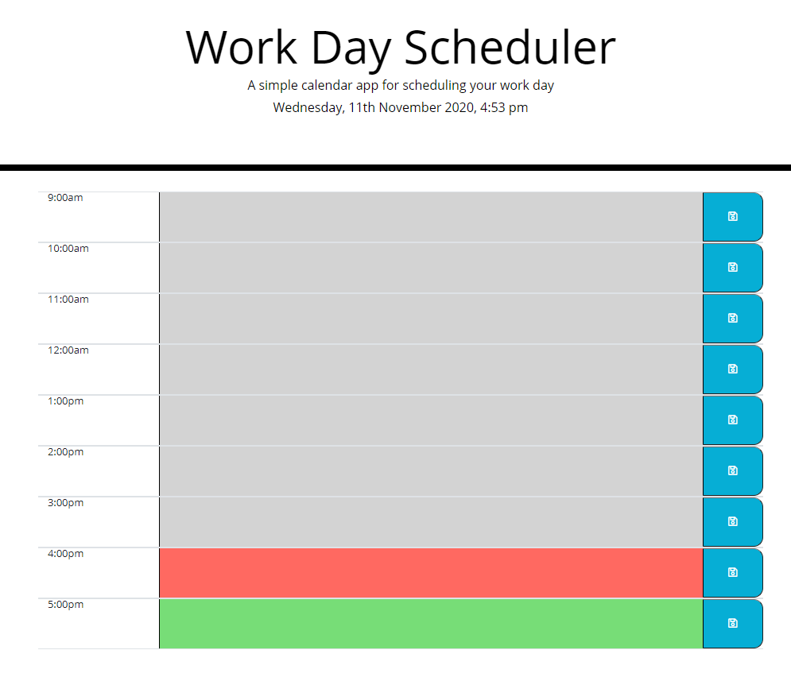

# work-scheduler

## Description
This page is a simple scheduler for your work day. This was my first attempt at using moment to get the current date/time information and then use it to change the page display.

This page populates the current date and time at the top with the heading. The rows are hard coded with a time value at the left and then have a text input field in the middle to write out tasks with a save button at the right to save the values in the input field into local storage. There is also a dynamic change of the background color for the input field depending on its relation to the current time. The row for the present hour is red, while the backgrounds for the past and future inputs are grey and green, respectively. The save buttons have a hover feature that make the icon grow a little and an active style change that changes the color while clicking to help the user know they successfully clicked the button.

## Link
Here is a link to the deployed page:
https://marenhamby.github.io/work-scheduler/

## Image
Here is a screenshot of the page:
